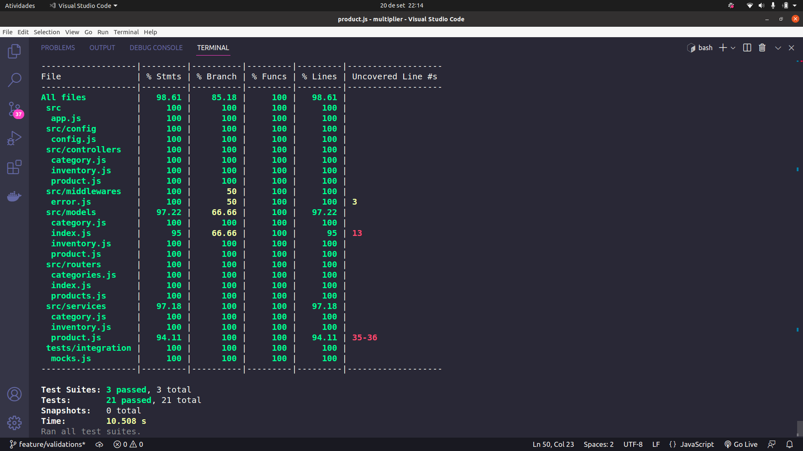
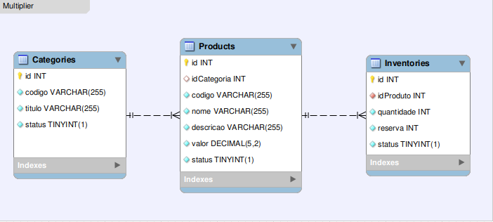

# Multiplier

## Decisões
- O README está em português. O código e os commits estão em inglês.
- Usei ESLint para padronizar o código
- Node + Express, Sequelize ORM, testes com Jest e commits semânticos foram utilizados pois eram requisitos do desafio
- Decidi usar a arquitetura MSC(model-service-controller) para organizar o código em camadas que agrupam partes com responsabilidades similares
- Na criação de um produto, decidi setar o status do estoque igual ao status passado ao produto

## Como rodar
1. Clone o repositório
- SSH: `git@github.com:lucasdvilar/multiplier.git`
- HTTPS: `https://github.com/lucasdvilar/multiplier.git`

2. Instale as dependências
- `npm install`

3. Variáveis de ambiente e criação do banco
- Defina suas variáveis de ambiente de acordo com o arquivo .env.example (lembre de renomear para .env) e crie o banco com `npm run prestart`

3. Opcões de execução
- Para executar: `npm start`
- Para executar em modo de desenvolvimento: `npm run dev`
- Para testar: `npm test`
- Lint: `npm run lint` (ou instalar a extensão ESLint)

## Documentação
- https://documenter.getpostman.com/view/21027257/2s7Z15F3RB

## Cobertura de testes
- É possível verificar com `npm test -- --coverage`

## Diagrama ER
